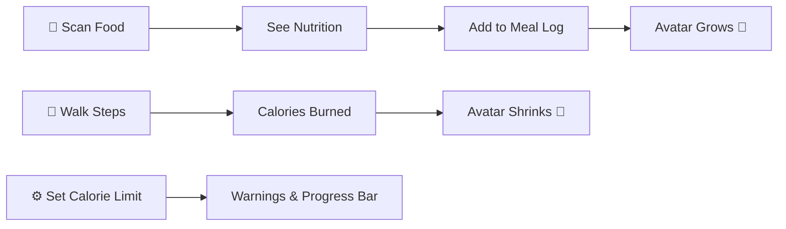

# YOTRACKEZ v2.0 — Avatar + Meal Tracking + Steps

Transform the food scanner into a full health tracking app with a gamified anime avatar system.

## Overview



---

## Phase 1: Meal Tracking & History
> **Goal:** Track what user eats, when, and show a daily timeline

### Features
- **Meal categories** auto-assigned by time of scan:
  - 6AM-11AM → Breakfast 🌅
  - 11AM-3PM → Lunch ☀️
  - 3PM-6PM → Snack 🍪
  - 6PM-11PM → Dinner 🌙
- **"Add to My Day"** button on the result screen after scanning
- **Meal History screen** with daily timeline showing each meal, time, and calories
- **Daily summary** card: total calories, protein, carbs, fat for the day
- **Daily calorie limit** setting with progress bar (green → yellow → red)
- **Local storage** using SQLite (`sqflite` package) for persistent meal data

### New Files
| File | Purpose |
|------|---------|
| `lib/models/meal_entry.dart` | MealEntry model (food name, calories, macros, timestamp, meal type) |
| `lib/models/user_settings.dart` | UserSettings model (calorie limit, gender, avatar state) |
| `lib/services/meal_db_service.dart` | SQLite database for storing meal history |
| `lib/services/settings_service.dart` | Persistent user settings storage |
| `lib/screens/meal_history_screen.dart` | Daily meal timeline with summary card |
| `lib/screens/daily_summary_screen.dart` | Detailed daily nutrition breakdown |

### Modified Files
| File | Change |
|------|--------|
| `lib/screens/result_screen.dart` | Add "Add to My Day" button |
| `lib/screens/home_screen.dart` | Add bottom nav bar (Home, History, Avatar, Settings) |
| `lib/main.dart` | Add navigation routes |
| `pubspec.yaml` | Add `sqflite`, `intl` (date formatting) |

---

## Phase 2: Anime Avatar System
> **Goal:** Visual character that reacts to calorie intake vs burn

### Features
- **First launch:** Ask Male/Female → assign base anime avatar
- **Avatar states** (5 levels based on net calories):
  - **Very Fit** (net < -500 cal) — slim, energetic pose
  - **Fit** (net -500 to 0) — normal, happy
  - **Normal** (net 0 to +300) — slightly bigger, neutral
  - **Chubby** (net +300 to +700) — bigger, tired
  - **Overweight** (net > +700) — biggest, sleepy
- **Avatar lives on the home screen** — always visible
- **Mood expressions** based on how close to calorie limit
- **Smooth transitions** between states (animated scaling)
- Net calories = calories eaten today − calories burned (steps)

### New Files
| File | Purpose |
|------|---------|
| `lib/widgets/avatar_widget.dart` | Animated avatar display with state transitions |
| `lib/screens/avatar_screen.dart` | Full screen avatar with stats overlay |
| `assets/avatars/` | Male & female anime avatar images (5 states × 2 genders = 10 images) |

### Avatar Images
- Will use `generate_image` tool to create 10 anime avatar variations
- Cute chibi-style anime characters
- Each state shows visible body size difference

---

## Phase 3: Step Counter & Calorie Burn
> **Goal:** Read steps from phone, calculate calories burned, update avatar

### Features
- **Read step count** from phone's built-in pedometer sensor
- **Calories burned** formula: `steps × 0.04` (approx 40 cal per 1000 steps)
- **Daily step count** displayed on home screen
- **Step history** in the meal history screen
- **Avatar shrinks** as steps increase (net calorie goes down)
- **Step goal** setting (default: 10,000 steps)

### New Files
| File | Purpose |
|------|---------|
| `lib/services/step_counter_service.dart` | Pedometer integration using `pedometer` package |
| `lib/widgets/step_counter_card.dart` | Step count display widget with circular progress |

### Modified Files
| File | Change |
|------|--------|
| `pubspec.yaml` | Add `pedometer_2` package |
| `lib/screens/home_screen.dart` | Show step count card |
| `lib/screens/meal_history_screen.dart` | Show calories burned from steps |

### Android Permissions Required
```xml
<!-- AndroidManifest.xml -->
<uses-permission android:name="android.permission.ACTIVITY_RECOGNITION"/>
```

---

## Phase 4: Build Android APK
> **Goal:** Create installable APK for the user's OnePlus phone

- Build release APK: `flutter build apk --release`
- Transfer to phone via USB or share link
- All features work natively on Android (camera, steps, storage)

---

## Open Questions

> [!IMPORTANT]
> **Avatar Art Style:** I'll generate cute chibi anime avatars using AI image generation. Male character will look like a young anime boy, female like a young anime girl. Both will have 5 weight states. Does this style sound good to you?

> [!IMPORTANT]
> **Calorie Limit Default:** What should the default daily calorie limit be? Common values:
> - 2000 cal (standard)
> - 1800 cal (light)
> - 2500 cal (active)

> [!IMPORTANT]
> **Step Counter vs Google Fit:** The simplest approach is reading the phone's **raw pedometer sensor** directly (works on all Android phones including OnePlus). Google Fit integration is more complex and requires API setup. Should I go with the **simple pedometer** approach?

---

## Verification Plan

### Automated Tests
- `flutter analyze` — zero issues
- `flutter build apk --release` — successful APK build

### Manual Verification
- Scan food → add to meal log → verify in history
- Check avatar changes size after adding meals
- Walk around → verify step count updates
- Set calorie limit → verify progress bar and warnings
- Install APK on phone → verify camera and steps work
