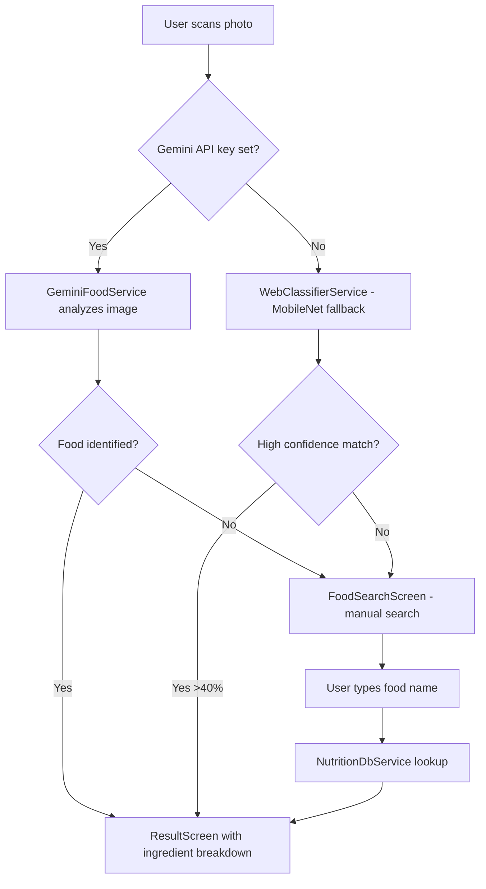

# YOTRACKEZ — Complete Project File Map

**Project Path:** `C:\Users\HP\.gemini\antigravity\scratch\nutri_snap`

---

## 📁 Project Structure

```
nutri_snap/
├── lib/
│   ├── main.dart                          # App entry point
│   ├── models/
│   │   └── nutrition_data.dart            # Data models (NutritionData, IngredientData)
│   ├── screens/
│   │   ├── home_screen.dart               # Home screen (scan/search buttons, API key dialog)
│   │   ├── food_search_screen.dart        # Food search + AI suggestion screen
│   │   └── result_screen.dart             # Nutrition result with ingredient breakdown
│   ├── services/
│   │   ├── api_key_service.dart           # [NEW] Gemini API key storage
│   │   ├── gemini_food_service.dart       # [NEW] Gemini Vision food recognition
│   │   ├── food_classifier_service.dart   # TFLite classifier (mobile/desktop stub)
│   │   ├── web_classifier_service.dart    # TensorFlow.js classifier (web fallback)
│   │   ├── imagenet_food_mapper.dart      # Maps ImageNet labels → food IDs
│   │   └── nutrition_db_service.dart      # Local JSON nutrition database
│   ├── theme/
│   │   └── app_theme.dart                 # Dark theme, colors, design tokens
│   └── widgets/
│       ├── image_source_sheet.dart        # Camera/gallery picker bottom sheet
│       └── nutrient_card.dart             # Macro nutrient card widget
├── assets/
│   ├── data/
│   │   └── nutrition_db.json              # 127 foods with nutrition + ingredient data
│   └── model/
│       └── food_labels.txt                # Food label IDs for classification
├── web/
│   ├── index.html                         # Web entry point
│   └── classifier.js                      # TensorFlow.js MobileNet wrapper
├── pubspec.yaml                           # Dependencies
└── windows/                               # Windows desktop config (needs VS C++ tools)
```

---

## 📄 File Details

### Core Files

| File | Purpose | Status |
|------|---------|--------|
| [main.dart](file:///C:/Users/HP/.gemini/antigravity/scratch/nutri_snap/lib/main.dart) | App entry, theme setup, routes | Original |
| [pubspec.yaml](file:///C:/Users/HP/.gemini/antigravity/scratch/nutri_snap/pubspec.yaml) | Dependencies — added `http` package | Modified |

---

### Models

| File | Purpose | Status |
|------|---------|--------|
| [nutrition_data.dart](file:///C:/Users/HP/.gemini/antigravity/scratch/nutri_snap/lib/models/nutrition_data.dart) | `NutritionData` + `IngredientData` models with JSON parsing | Modified — added `IngredientData` class, `ingredients` list, `hasIngredients` getter |

---

### Screens

| File | Purpose | Status |
|------|---------|--------|
| [home_screen.dart](file:///C:/Users/HP/.gemini/antigravity/scratch/nutri_snap/lib/screens/home_screen.dart) | Home with scan/search buttons, settings gear, AI status badge, Gemini analyze flow | Modified — added Gemini integration, API key dialog, "ANALYZING..." state |
| [food_search_screen.dart](file:///C:/Users/HP/.gemini/antigravity/scratch/nutri_snap/lib/screens/food_search_screen.dart) | Food search with AI suggestions, manual search | Modified — hidden food list on scan, auto-navigate on high confidence |
| [result_screen.dart](file:///C:/Users/HP/.gemini/antigravity/scratch/nutri_snap/lib/screens/result_screen.dart) | Nutrition result with expandable ingredient cards, nutrition bars | Rewritten — full ingredient breakdown UI |

---

### Services

| File | Purpose | Status |
|------|---------|--------|
| [api_key_service.dart](file:///C:/Users/HP/.gemini/antigravity/scratch/nutri_snap/lib/services/api_key_service.dart) | Stores/retrieves Gemini API key (SharedPreferences), has default key baked in | **NEW** |
| [gemini_food_service.dart](file:///C:/Users/HP/.gemini/antigravity/scratch/nutri_snap/lib/services/gemini_food_service.dart) | Sends food image to Gemini Vision API, returns `NutritionData` with ingredients | **NEW** |
| [food_classifier_service.dart](file:///C:/Users/HP/.gemini/antigravity/scratch/nutri_snap/lib/services/food_classifier_service.dart) | TFLite classifier stub (for mobile/desktop, not used on web) | Original |
| [web_classifier_service.dart](file:///C:/Users/HP/.gemini/antigravity/scratch/nutri_snap/lib/services/web_classifier_service.dart) | TensorFlow.js MobileNet classifier (web fallback) | Original |
| [imagenet_food_mapper.dart](file:///C:/Users/HP/.gemini/antigravity/scratch/nutri_snap/lib/services/imagenet_food_mapper.dart) | Maps ImageNet labels to food database IDs | Modified — removed bad mappings, added confidence threshold |
| [nutrition_db_service.dart](file:///C:/Users/HP/.gemini/antigravity/scratch/nutri_snap/lib/services/nutrition_db_service.dart) | Loads & searches local nutrition JSON database | Original |

---

### Assets

| File | Purpose | Status |
|------|---------|--------|
| [nutrition_db.json](file:///C:/Users/HP/.gemini/antigravity/scratch/nutri_snap/assets/data/nutrition_db.json) | 127 foods — 101 original + 15 Indian dishes + 11 standalone ingredients, 33 with ingredient breakdowns | Modified — massively expanded |
| [food_labels.txt](file:///C:/Users/HP/.gemini/antigravity/scratch/nutri_snap/assets/model/food_labels.txt) | Food label IDs for classifier | Modified — added 26 new labels |

---

### Theme & Widgets

| File | Purpose | Status |
|------|---------|--------|
| [app_theme.dart](file:///C:/Users/HP/.gemini/antigravity/scratch/nutri_snap/lib/theme/app_theme.dart) | Dark theme, glassmorphism, color palette | Original |
| [image_source_sheet.dart](file:///C:/Users/HP/.gemini/antigravity/scratch/nutri_snap/lib/widgets/image_source_sheet.dart) | Camera/gallery picker bottom sheet | Original |
| [nutrient_card.dart](file:///C:/Users/HP/.gemini/antigravity/scratch/nutri_snap/lib/widgets/nutrient_card.dart) | Macro nutrient display card | Original |

---

## 🔑 Key Architecture



## 🏃 How to Run

```bash
# Web (localhost)
cd C:\Users\HP\.gemini\antigravity\scratch\nutri_snap
flutter build web --release
python -m http.server 3000 --directory build/web
# Open http://localhost:3000

# Windows desktop (needs Visual Studio C++ tools)
flutter build windows --release
# .exe at build\windows\x64\runner\Release\nutri_snap.exe
```
